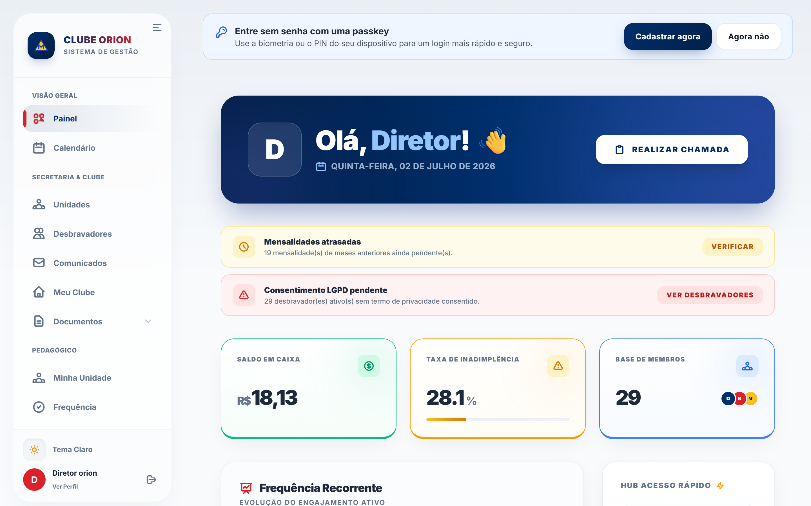
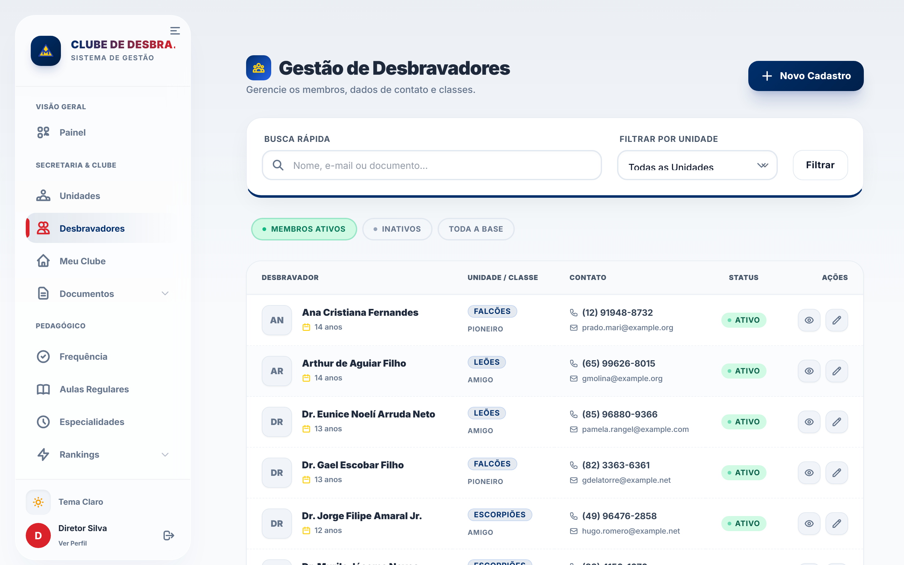
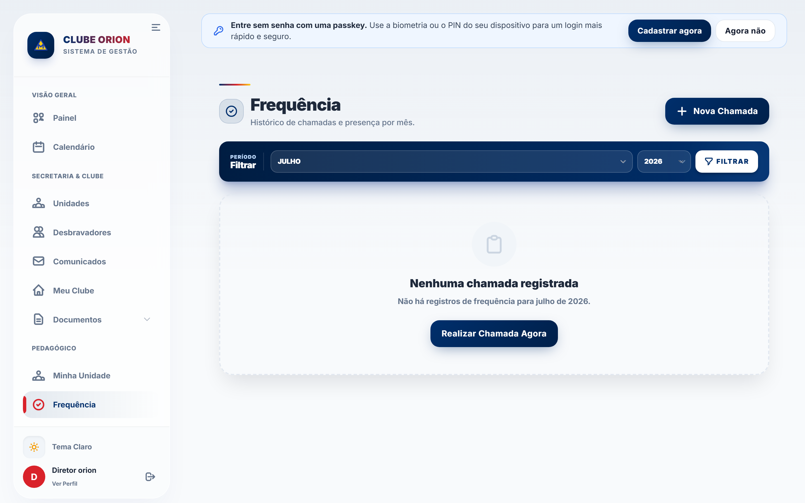
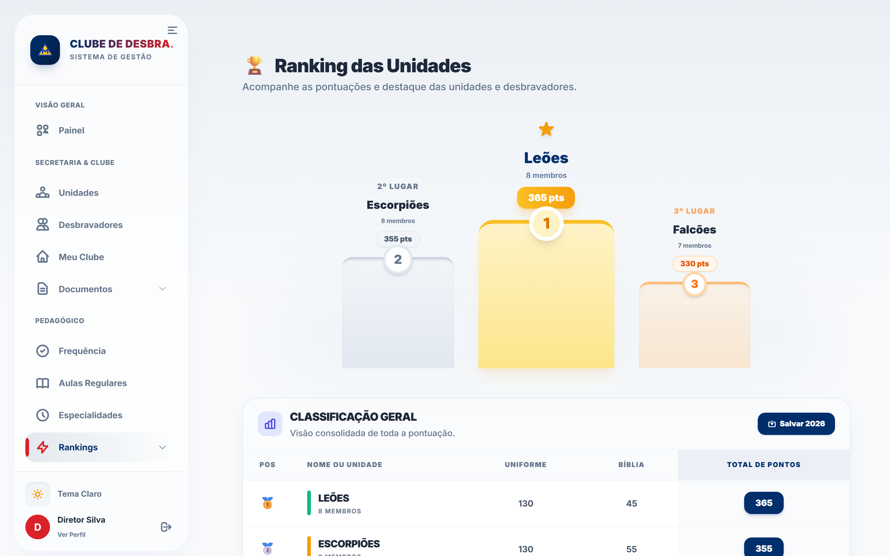
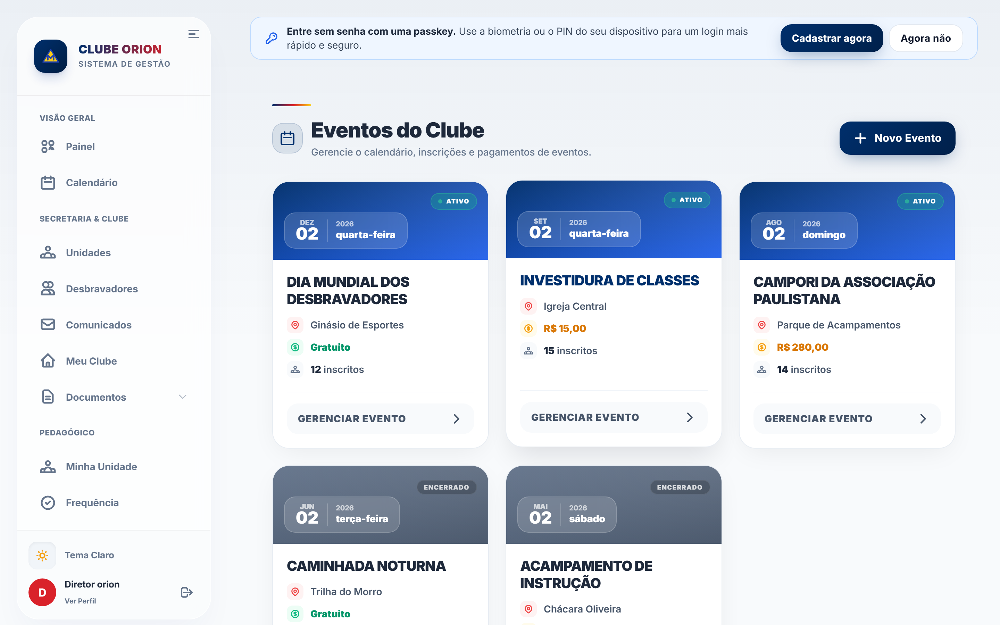
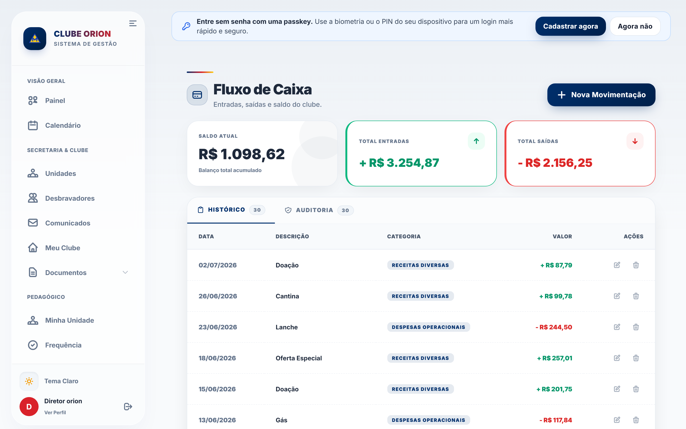
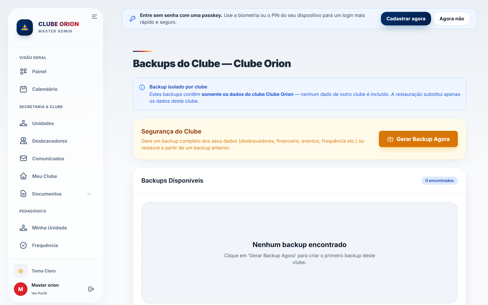

<div align="center">


# Desbravadores Manager

**Plataforma web completa para a gestão de clubes de Desbravadores**  
Secretaria · Financeiro · Pedagógico · Eventos · Patrimônio · Relatórios

<br />

[](#)
[](https://laravel.com)
[](https://php.net)
[](https://tailwindcss.com)
[](#-licença)

<br />

[](https://github.com/JohnAugust934/ManagerDBV/actions/workflows/laravel.yml)


<br />



</div>

---

<div align="center">

### 🌟 Centralize toda a operação do seu clube em um único lugar

Multi-tenant · Controle de acesso por função · Trilha de auditoria · Backups com verificação de integridade · Notificações em tempo real · PWA instalável

</div>

---

## 📑 Sumário

- [Visão Geral](#-visão-geral)
- [Multi-tenant](#-multi-tenant)
- [Capturas de Tela](#-capturas-de-tela)
- [Principais Módulos](#-principais-módulos)
- [Recursos Transversais](#-recursos-transversais)
- [Stack Tecnológica](#-stack-tecnológica)
- [Instalação](#-instalação-local)
- [Scripts Úteis](#-scripts-úteis)
- [Acessos de Desenvolvimento](#-acessos-de-desenvolvimento-seeder)
- [Controle de Acesso](#-controle-de-acesso)
- [Estrutura de Pastas](#-estrutura-de-pastas)
- [Backups e Restauração](#-backups-e-restauração)
- [Deploy](#-deploy)
- [Qualidade e Testes](#-qualidade-e-testes)
- [Roadmap](#-roadmap)
- [Contribuição](#-contribuição)
- [Licença](#-licença)

---

## 🎯 Visão Geral

O **Desbravadores Manager** centraliza as rotinas administrativas de um clube em uma única aplicação web. Foi pensado para o dia a dia real da secretaria, da tesouraria e da equipe pedagógica, com **isolamento total de dados entre clubes (multi-tenant)**, **controle de acesso por função**, **trilha de auditoria** e um **subsistema de backup com verificação de integridade**.

Todo o domínio e a interface estão em **português (pt_BR)**, com UI **mobile-first**, suporte a PWA (app instalável) e foco em acessibilidade (meta de contraste WCAG 2.1 AA).

| | |
|---|---|
| 👥 **Membros e unidades** | Cadastro completo de desbravadores e organização em unidades |
| 📋 **Administração** | Dados institucionais do clube, atas e atos oficiais |
| 💰 **Financeiro** | Caixa, mensalidades e patrimônio |
| 📚 **Pedagógico** | Classes, especialidades, frequência configurável e pontuação |
| 🎪 **Eventos** | Criação, inscrições em lote, status de pagamento e autorizações |
| 🏆 **Ranking** | Pontuação ao vivo por unidade + snapshots anuais |
| 📄 **Relatórios** | PDFs operacionais e hub de relatórios personalizados |

---

## 🏢 Multi-tenant

A v5.0.0 introduz multi-tenancy completo. Cada clube opera em isolamento total — um usuário de um clube nunca enxerga, nem por acidente, dados de outro.

### Como funciona

- **Global scopes automáticos:** models com `club_id` direto usam `ClubScope`; `Desbravador` usa `DesbravadorClubScope` (filtra via `unidade.club_id`). O escopo é aplicado a todas as queries automaticamente.
- **Fail-closed:** usuário sem clube ativo não enxerga nenhum dado (ao contrário da versão anterior, que era fail-open).
- **Índices compostos por tenant:** unicidades (ex.: CPF) são garantidas _por clube_, não globalmente.
- **Contexto fora do HTTP:** `ClubContext::actAs($clube, fn() => ...)` propaga o tenant em jobs de fila, commands e outros contextos sem request.

### Perfil `platform_admin`

O cargo `platform_admin` é um super-administrador cross-tenant, separado dos usuários de clube:

- Acessa o painel de gestão de clubes (`/clubes`) — cria, suspende e exclui clubes
- Enxerga dados de todos os clubes (sem restrição de scope)
- Gerencia a equipe da plataforma
- **Não pertence a nenhum clube** — `club_id = null` permanece nulo

> O antigo papel `master` (admin do clube) continua existindo, porém agora é um papel _dentro_ do clube, com acesso total aos dados daquele clube específico.

### Catálogo global

Existe um catálogo read-only de especialidades e classes compartilhado entre todos os clubes. Cada clube pode personalizar localmente sem afetar o catálogo global.

### Migração de instalações single-tenant

Quem vinha da v4.x pode migrar sem perda de dados. Veja `docs/UPGRADE-MULTITENANT.md` para o passo a passo com o comando `tenant:upgrade-legacy`.

---

## 🖼️ Capturas de Tela

<div align="center">

| Desbravadores | Frequência |
|:---:|:---:|
|  |  |
| **Ranking** | **Eventos** |
|  |  |
| **Caixa (Financeiro)** | **Backups** |
|  |  |

</div>

> 📷 Galeria completa de telas em [`public/images/manual/`](public/images/manual/).  
> As capturas são geradas automaticamente pelo script [`scripts/shots.mjs`](scripts/shots.mjs) (Playwright) a partir da aplicação rodando com dados de demonstração.

---

## 🧩 Principais Módulos

### 📋 Secretaria
- Dados institucionais do clube
- Cadastro completo de desbravadores
- Unidades
- Atas e atos oficiais

### 📚 Pedagógico
- Classes e requisitos
- Especialidades por desbravador
- Frequência com **colunas de chamada configuráveis por clube** (Presente, Pontual, Bíblia, Uniforme + colunas personalizadas), com pontuação automática

### 💰 Financeiro
- Caixa (entradas e saídas, com trilha de autoria)
- Mensalidades (geração e baixa de pagamento)
- Patrimônio (itens e estado de conservação)

### 🎪 Eventos
- Criação e gestão de eventos
- Inscrição individual e em lote
- Controle de pagamento/status
- Geração de autorização em PDF

### 🏆 Ranking
- Pontuação ao vivo por unidade (com exclusão opcional de unidades)
- Snapshots anuais automáticos para histórico e auditoria

### 📄 Relatórios
- Hub de relatórios personalizados
- Relatórios por módulo
- PDFs de fichas e documentos (autorização, carteirinha, ficha médica, financeiro, patrimônio)

---

## ⚙️ Recursos Transversais

| Recurso | Descrição |
|---|---|
| 🏢 **Multi-tenant** | Dados isolados automaticamente por clube via global scopes. Isolamento fail-closed. O `platform_admin` enxerga todos os clubes. |
| 🔐 **Controle de acesso** | Autenticação com verificação de e-mail + autorização por função e permissões de módulo (Gates / `can:*`). Registro apenas por convite. |
| 🕵️ **Trilha de auditoria** | Preenchimento automático de `created_by` / `updated_by` em registros sensíveis (caixa, desbravadores). |
| 💾 **Backups robustos** | `spatie/laravel-backup` + camada própria de integridade (SHA-256, manifesto por arquivo, histórico em banco e deep-verify mensal). |
| 📣 **Monitoramento** | Notificações via Telegram para falhas de backup, fila e exceções, com relatório diário consolidado. |
| ⏰ **Agendamento** | Tarefas de madrugada (backup, limpeza, monitoramento, snapshot anual de ranking) em `routes/console.php`. |
| 📲 **PWA** | App instalável no celular/desktop. Atualização parcial sem reload forçado. |
| ❤️ **Health checks** | `GET /health` (verifica o banco) e `/up` (nativo do Laravel). |

---

## 🛠️ Stack Tecnológica

<div align="center">

| Camada | Tecnologia |
|---|---|
| **Backend** | Laravel 12 · PHP 8.2+ |
| **Frontend** | Blade · Alpine.js · Tailwind CSS |
| **Build** | Vite |
| **Banco de dados** | SQLite (padrão) · PostgreSQL · MySQL |
| **PDF** | `barryvdh/laravel-dompdf` |
| **Backup** | `spatie/laravel-backup` |
| **Testes** | Pest |
| **Formatação** | Laravel Pint |

</div>

### Requisitos

- PHP 8.2+
- Composer
- Node.js 20+ e npm
- Banco de dados (SQLite, PostgreSQL ou MySQL)

---

## 🚀 Instalação (Local)

```bash
# 1. Clonar
git clone <URL_DO_REPOSITORIO>
cd ManagerDBV

# 2. Dependências
composer install
npm install

# 3. Ambiente
cp .env.example .env
php artisan key:generate

# 4. Banco de dados (SQLite padrão) + dados de demonstração
php artisan migrate --seed

# 5. Rodar (em terminais separados)
php artisan serve   # http://127.0.0.1:8000
npm run dev
```

### ⚡ Setup em um comando

```bash
composer run setup
```

> Instala dependências, configura o `.env`, gera a key, roda as migrations e faz o build do frontend.

---

## 📜 Scripts Úteis

```bash
# Fluxo de desenvolvimento completo (servidor + fila + logs + vite, via concurrently)
composer run dev

# Frontend
npm run dev
npm run build

# Backend
php artisan serve
php artisan migrate
php artisan migrate:fresh --seed     # reset completo com dados de demonstração

# Testes (Pest, em SQLite :memory: — não tocam o banco de dev)
composer test                        # config:clear + artisan test (preferível)
php artisan test
php artisan test --filter=BackupIntegrityVerifierTest

# Formatação (Pint) — formate apenas os arquivos que tocar
./vendor/bin/pint app/ database/ tests/
./vendor/bin/pint --test app/ database/ tests/
```

---

## 🔑 Acessos de Desenvolvimento (Seeder)

Após `migrate --seed`, o seeder cria **5 clubes** (São Paulo, um por Associação Paulista: `orion`, `aurora`, `vega`, `sirius`, `antares`). Senha para todos: **`password`**.

**Platform admin (cross-tenant, sem clube):**

| Perfil | E-mail |
|---|---|
| 👑 Platform Admin | `admin@clube.com` |

**Por clube** — padrão `<cargo>.<slug>@clube.com` (ex.: `diretor.orion@clube.com`):

| Cargo | Exemplo (clube orion) |
|---|---|
| master | `master.orion@clube.com` |
| diretor | `diretor.orion@clube.com` |
| secretaria | `secretaria.orion@clube.com` |
| tesoureiro | `tesoureiro.orion@clube.com` |
| instrutor | `instrutor.orion@clube.com` |
| conselheiro1–4 | `conselheiro1.orion@clube.com` |

Substitua `orion` por `aurora`, `vega`, `sirius` ou `antares` para os demais clubes. Cada clube já vem com 4 unidades, ~30 desbravadores, especialidades, 6 chamadas de frequência, 5 eventos, financeiro, patrimônio e 6 documentos.

> ⚠️ **Produção:** o `DatabaseSeeder` redireciona automaticamente para `MasterOnlySeeder`. Rode apenas `php artisan db:seed --class=MasterOnlySeeder`.

---

## 🛡️ Controle de Acesso

Autenticação com verificação de e-mail e autorização por **função + permissão de módulo**.

**Perfis de clube:** `master` · `diretor` · `secretario` · `tesoureiro` · `conselheiro` · `instrutor`

**Perfil de plataforma:** `platform_admin` (cross-tenant, gerencia clubes e equipe da plataforma)

**Módulos de permissão:** `gestao_acessos` · `secretaria` · `financeiro` · `unidades` · `pedagogico` · `eventos` · `relatorios`

Cada usuário recebe os padrões do seu papel, podendo ter `extra_permissions` adicionais. O registro de novos usuários ocorre **apenas por convite** (`/register-invite`).

---

## 🗂️ Estrutura de Pastas

```text
app/
├─ Console/Commands/   # Comandos artisan personalizados (backup, ranking, tenant:upgrade-legacy)
├─ Http/               # Controllers e middleware
├─ Models/             # Models, global scopes (ClubScope, DesbravadorClubScope) e traits
├─ Services/           # Backup integrity, Telegram, ClubContext (tenant em fila/console)
└─ Support/            # Utilitários (janelas operacionais, etc.)
bootstrap/             # bootstrap/app.php (config central do Laravel 11/12)
config/
database/             # Migrations, factories, seeders
docs/                 # Documentação técnica (DEPLOY, RESTORE, UPGRADE-MULTITENANT, guia UI)
public/images/manual/ # Capturas de tela / manual
resources/
├─ css/               # Design system base
└─ views/             # Telas Blade
routes/               # web.php e console.php (agendamento)
tests/                # Testes Pest
```

---

## 💾 Backups e Restauração

O sistema usa `spatie/laravel-backup` com uma **camada própria de integridade**:

- ✅ Backup do banco + uploads (`storage/app/public`)
- ✅ Verificação no evento de sucesso: tamanho mínimo, reabertura do zip, SHA-256 e manifesto por arquivo
- ✅ Histórico persistido em banco (`backup_logs`)
- ✅ Verificação profunda mensal (lê o dump dentro do zip)
- 🚨 Alertas imediatos no Telegram em caso de falha
- 🖥️ Telas administrativas de backup/restauração para o `platform_admin`

> Runbook de restauração em [`docs/RESTORE.md`](docs/RESTORE.md).

---

## 🌐 Deploy

Guia completo em [`docs/DEPLOY.md`](docs/DEPLOY.md). Pontos-chave:

```bash
composer install --no-dev --optimize-autoloader
npm ci && npm run build
php artisan migrate --force
php artisan storage:link
php artisan config:cache && php artisan route:cache && php artisan view:cache
```

- Worker de fila via Supervisor (`queue:work database`)
- Cron de 1 minuto rodando `php artisan schedule:run`
- Sempre executar `backup:run` antes de deploy com migrations
- Template de produção em `.env.production.example`

> Migrando de uma instalação single-tenant (v4.x)? Veja [`docs/UPGRADE-MULTITENANT.md`](docs/UPGRADE-MULTITENANT.md).

---

## ✅ Qualidade e Testes

```bash
composer test       # config:clear + artisan test (preferível)
php artisan test    # todos os testes
npm run build       # build de produção
```

> 🎯 O foco atual do projeto é **endurecer qualidade** (robustez, cobertura de testes e consistência de dados financeiros) em vez de novas features.

---

## 🗺️ Roadmap

| Status | Item |
|---|---|
| ✅ | Multi-tenant completo (isolamento fail-closed, `platform_admin`, catálogo global, `ClubContext`) |
| ✅ | Subsistema de backup com verificação de integridade (SHA-256, manifesto, deep-verify) |
| ✅ | Colunas de chamada configuráveis por clube |
| ✅ | Snapshots anuais de ranking |
| ✅ | Pipeline de CI (Pest + Pint) |
| ✅ | PWA instalável |
| ⬜ | Ampliar cobertura de testes (financeiro e frequência) |
| ⬜ | Unificar a lógica duplicada de pontuação de ranking |
| ⬜ | Ligar o Gate `gerir-unidade` às rotas de unidade (escopo por conselheiro) |
| ⬜ | Exportações adicionais (planilhas) e novos relatórios financeiros |
| ⬜ | Refino contínuo de acessibilidade (WCAG 2.1 AA) |

---

## 🤝 Contribuição

1. Crie uma branch (`feat/minha-melhoria`)
2. Faça commits pequenos e objetivos
3. Rode os testes (`composer test`) e o build (`npm run build`)
4. Formate apenas os arquivos tocados (`./vendor/bin/pint`)
5. Abra um Pull Request com descrição clara

> Antes de criar novas telas, consulte o [Guia Visual UI](docs/guia-visual-ui.md) (padrão de botões, layout, acessibilidade).

---

## 📄 Licença

Distribuído sob a licença **MIT** (base Laravel). Sinta-se livre para usar como referência e estudo.

---

<div align="center">

Feito com ❤️ para os clubes de Desbravadores

</div>
